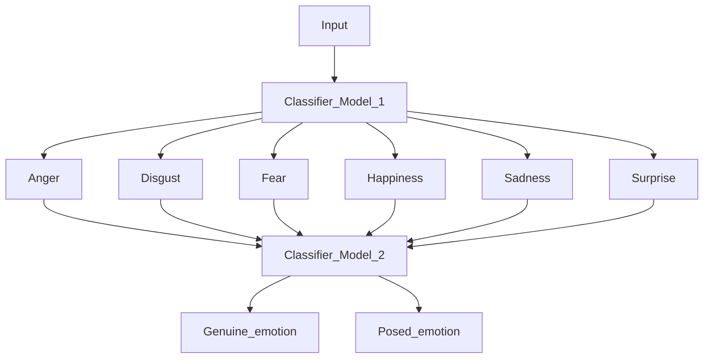

# Genuine Posed EmotionRecognition

## Table of Contents
- [Introduction](#introduction)
- [Dataset](#dataset)
- [Requirements](#requirements)
- [Usage](#usage)
- [Results](#results)
- [License](#license)

## Introduction
### Master in Data Science for Decision Making
Student - Dimitrios Gagatsis
Thesis Supervisor - Mirela Popa
This is a reopository of my master thesis that is about to start.
The Thesis name is "Detection of Genuine and Posed Facial Expressions of Emotions"
The Data sources for this project are: SASE-FE Dataset.

## 🚀 Models
<!-- Generate table -->

| Model | Paper |
|  ---  |  ---  |
| VGG-LSTM | [paper](https://www.researchgate.net/publication/339836787_Pedestrian_Navigation_Method_Based_on_Machine_Learning_and_Gait_Feature_Assistance) | 
| ResNet50-LSTM |[paper](https://www.hindawi.com/journals/wcmc/2020/8909458/) |
| SENet-LSTM | [paper](https://ieeexplore.ieee.org/document/9568952) |
| 3D-CNN | [paper](https://keras.io/examples/vision/3D_image_classification/#:~:text=A%203D%20CNN%20is%20simply,learning%20representations%20for%20volumetric%20data.) |
| ResNet3D | [paper](https://paperswithcode.com/model/resnet-3d?variant=resnet-3d-18) |

## Previous Approaches
<!-- Generate table -->

| Paper | Link |
|  ---  |  ---  |
| Real vs. Fake Emotion Challenge: Learning to Rank Authenticity From Facial Activity Descriptors | [paper](https://www.researchgate.net/publication/319316240_Real_vs_Fake_Emotion_Challenge_Learning_to_Rank_Authenticity_From_Facial_Activity_Descriptors) |
|Real and fake emotion detection using enhanced boosted support vector machine algorithm|[paper](https://link.springer.com/article/10.1007/s11042-022-13210-6)|
|Discrimination between genuine versus fake emotion using long-short term memory with parametric bias and facial landmarks|[paper](https://ieeexplore.ieee.org/document/8265573)|
|Classifying posed and natural facial expressions with the help of Deep Learning|[paper](https://www.scss.tcd.ie/publications/theses/diss/2020/TCD-SCSS-DISSERTATION-2020-100.pdf)| 

## Approach

# Add more details based on the Thesis Proposal here. 
