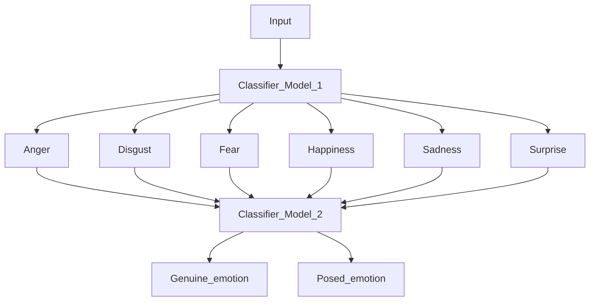

# Multi-Label, Multi-Task Deep Learning Approach Towards Detection The Differences Between Real And Fake Emotions

## Table of Contents
- [Introduction](#introduction)
- [Dataset](#dataset)
- [Approach](#approach)
- [References](#references)

## Introduction
Emotion recognition is an important source of emotional and social information in interpersonal communication. Knowing what other individual feels is relevant in predicting a person's psychological state, such as future behavior and the outcome of social interactions (Johnston et al., 2010). Recognizing emotions from facial expressions generally could be done easily by individuals. However, determining the authenticity of such expressions is a difficult task. Subtle differences between genuine and posed facial expressions are very small facial details that are hard to recognize by the human eye. Currently, limited deep learning research has dealt with identifying fake emotions with accuracy in a range of 51- 76%. The minor differences between genuine and posed emotions make their detection a complex problem. Hence, various deep learning model architectures should be investigated using dedicated loss function and training strategies.
During my master thesis on the detection of genuine and posed emotions, a video dataset will be explored and used to make experiments with several model combinations to develop a deep learning model for the proposed task.

---------------------
### Dataset:
The SASE-FE Dataset (Kulkarni et al., 2018) created by the iCV Research Lab contains 643 different videos captured with high-resolution cameras recording 100 frames per second, containing video recordings of 54 participants of ages 19-36. The main reason behind the choice of such an age-range sample is that older adults have different, more positive responses than younger adults about feelings and emotions, and they are faster and more precise to regulate emotional states than younger adults (Dahling & Perez, 2010; Isaacowitz, 2012; Ready et al., 2017). More specifically, for each recording, participants were asked to act two facial expressions of emotions in a sequence, a genuine and a posed emotion. Genuine emotions are the six expressions happiness, sadness, anger, disgust, contempt, and surprise. For eliciting genuine and realistic emotions, proposed videos based on emotion science research (Gross & Levenson, 1995), were shown to the participants to increase the realism of their emotions. To increase the distinction between the two facial expressions presented in the sequence, the two emotions were chosen based on their visual and conceptual differences. Thus, the contrast was created by asking the participants to act happy after being Sad, Surprised after being Sad, Disgusted after being Happy, Sad after being Happy, Angry after being Happy, and Contemptuous after being Happy. Note that the participants were asked to start their video recordings from a neutral face and none of the participants were aware of the fact that they would be asked to act with a second facial expression.

---------------------
### Approach:
Previous approaches tried several architectures to tackle this problem. For example, LSTM(Kim & Huynh, 2017) networks and SVMs(Saxen et al., 2017) are used in several approaches combined with other models to tackle the fake and real emotion recognition task. More specifically, an interesting approach focused on using deep recurrent networks such as LSTM by which features are extracted in the spatial-temporal domain from the facial landmarks, and then compress to two vectors, one for genuine and the other for posed emotions. Lastly, a binary classifier based on gradient boosting is used to enhance discrimination capability. Another interesting approach to tackle this problem proposed the Rank SVM Ensemble. From a pair of videos, action unit intensities were automatically estimated and facial activity descriptors computed. Following, the descriptors of both videos are combined and classified to detect the more genuine of those videos by using the rank SVM Ensemble.

During my master thesis, the SASE-FE dataset will be explored and used to develop a deep learning model for the Genuine and Posed Facial Expressions of Emotions detection task. The videos of the SASE-FE dataset will be used to train a classifier model for the genuine and posed emotion recognition task. The main influence of this thesis is the multi-label, multi-task CNN approach for context-based emotion recognition (Bendjoudi et al., 2021). A newly developed deep learning architecture that is built from three main modules. A body features an extraction module which is a pre-trained Xception network, a scene features an extraction module based on a modified VGG16 network and a fusion decision module.

My thesis approach includes the adaptation of the above architecture idea to the genuine and posed emotion recognition task. The first part includes the facial feature extraction from the videos and the generation of two vectors. Those vectors will be used in the second part of the architecture, a binary classification model for determining if the given emotion is real or not. Therefore, several deep learning models will be tested, to extract facial features, and experiments with the multi-label focal loss function (MFL) and other standard loss functions, such as Cross-Entropy and euclidean Loss, will be conducted. In addition, after experimentation with several architectures, research for improving the recognition robustness can be made by taking into account the redundancy principle proposed (Frédéric & Zieba, 2014).

To sum up, each person has a unique way of expressing emotions and facial expressions. Certainly, there are basic similarities, but there are also substantial differences. Factors such as the age, face shape, characteristics, and acting skills of every person increase the variability between subjects and thus makes the problem difficult. Therefore, the generalization ability of a deep learning model to recognize real and fake facial expressions is a difficult problem that needs to be investigated.

---------------------
### References
Bendjoudi, I., Vanderhaegen, F., Hamad, D., & Dornaika, F. (2021). Multi-label, multi-task CNN approach for context-based emotion recognition. Information Fusion, 76, 422–428. https://doi.org/10.1016/j.inffus.2020.11.007

Dahling, J., & Perez, L. (2010). Older worker, different actor? Linking age and emotional labor strategies. Personality and Individual Differences - PERS INDIV DIFFER, 48, 574–578. https://doi.org/10.1016/j.paid.2009.12.009

Frédéric, V., & Zieba, S. (2014). Reinforced learning systems based on merged and cumulative knowledge to predict human actions. Information Sciences, 276, 146–159. https://doi.org/10.1016/j.ins.2014.02.051

Gross, J. J., & Levenson, R. W. (1995). Emotion elicitation using films. Cognition and Emotion, 9(1), 87–108. https://doi.org/10.1080/02699939508408966

Isaacowitz, D. M. (2012). Mood Regulation in Real Time: Age Differences in the Role of Looking. Current Directions in Psychological Science, 21(4), 237–242. https://doi.org/10.1177/0963721412448651

Johnston, L., Miles, L., & Macrae, C. N. (2010). Why are you smiling at me? Social functions of enjoyment and non- enjoyment smiles. British Journal of Social Psychology, 49(1), 107–127. https://doi.org/10.1348/014466609X412476

Kim, Y.-G., & Huynh, X.-P. (2017). Discrimination Between Genuine Versus Fake Emotion Using Long-Short Term Memory with Parametric Bias and Facial Landmarks. 2017 IEEE International Conference on Computer Vision Workshops (ICCVW), 3065–3072. https://doi.org/10.1109/ICCVW.2017.362

Kulkarni, K., Corneanu, C. A., Ofodile, I., Escalera, S., Baro, X., Hyniewska, S., Allik, J., & Anbarjafari, G. (2018). Automatic Recognition of Facial Displays of Unfelt Emotions (arXiv:1707.04061). arXiv. http://arxiv.org/abs/1707.04061

Ready, R. E., Santorelli, G. D., & Mather, M. A. (2017). Judgment and classification of emotion terms by older and younger adults. Aging & Mental Health, 21(7), 684–692. https://doi.org/10.1080/13607863.2016.1150415

Saxen, F., Werner, P., & Al-Hamadi, A. (2017, October 1). Real vs. Fake Emotion Challenge: Learning to Rank Authenticity From Facial Activity Descriptors. https://doi.org/10.1109/ICCVW.2017.363

---------------------
## 🚀 Models

| Model | Paper |
|  ---  |  ---  |
| VGG-LSTM | [paper](https://www.researchgate.net/publication/339836787_Pedestrian_Navigation_Method_Based_on_Machine_Learning_and_Gait_Feature_Assistance) | 
| ResNet50-LSTM |[paper](https://www.hindawi.com/journals/wcmc/2020/8909458/) |
| SENet-LSTM | [paper](https://ieeexplore.ieee.org/document/9568952) |
| 3D-CNN | [paper](https://keras.io/examples/vision/3D_image_classification/#:~:text=A%203D%20CNN%20is%20simply,learning%20representations%20for%20volumetric%20data.) |
| ResNet3D | [paper](https://paperswithcode.com/model/resnet-3d?variant=resnet-3d-18) |

## Previous Approaches

| Paper | Link |
|  ---  |  ---  |
| Real vs. Fake Emotion Challenge: Learning to Rank Authenticity From Facial Activity Descriptors | [paper](https://www.researchgate.net/publication/319316240_Real_vs_Fake_Emotion_Challenge_Learning_to_Rank_Authenticity_From_Facial_Activity_Descriptors) |
|Real and fake emotion detection using enhanced boosted support vector machine algorithm|[paper](https://link.springer.com/article/10.1007/s11042-022-13210-6)|
|Discrimination between genuine versus fake emotion using long-short term memory with parametric bias and facial landmarks|[paper](https://ieeexplore.ieee.org/document/8265573)|
|Classifying posed and natural facial expressions with the help of Deep Learning|[paper](https://www.scss.tcd.ie/publications/theses/diss/2020/TCD-SCSS-DISSERTATION-2020-100.pdf)| 

## Algorithm Idea

